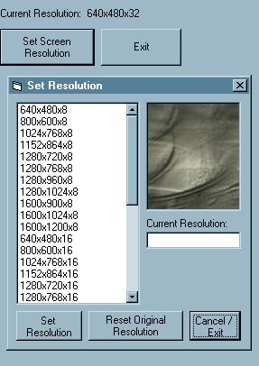

<div align="center">

## Screen Resolution Changer


</div>

### Description

This project demonstrates how to change screen resolution (i.e. screen area in display settings) to any supported value on your machine.
 
### More Info
 
User sets screen resolution.

There are some extra API calls which are not used in this project because it is going into something bigger which uses several other graphics capabilities, such as recreating TransparentBlt from msimg32.dll because of the memory leak in the function in win9x.

Sets screen resolution based on default refresh rate values for resolutions.

Note: This is a basic sample, and does not prompt the user to insure the resolution chosen is compatible with the monitor (or monitor driver) installed on the computer. If you are unsure about your display capabilities, do not set the resolution higher than what you are currently using!


<span>             |<span>
---                |---
**Submitted On**   |2002-04-01 23:44:56
**By**             |[Vince Soto](https://github.com/Planet-Source-Code/PSCIndex/blob/master/ByAuthor/vince-soto.md)
**Level**          |Intermediate
**User Rating**    |5.0 (10 globes from 2 users)
**Compatibility**  |VB 4\.0 \(32\-bit\), VB 5\.0, VB 6\.0
**Category**       |[Graphics](https://github.com/Planet-Source-Code/PSCIndex/blob/master/ByCategory/graphics__1-46.md)
**World**          |[Visual Basic](https://github.com/Planet-Source-Code/PSCIndex/blob/master/ByWorld/visual-basic.md)
**Archive File**   |[Screen\_Res676794220\.zip](https://github.com/Planet-Source-Code/vince-soto-screen-resolution-changer__1-33323/archive/master.zip)

### API Declarations

```
BitBlt SetBkColor CreateCompatibleDC DeleteDC CreateBitmap CreateCompatibleBitmap SelectObject DeleteObject GetObject ChangeDisplaySettings EnumDisplaySettings ExitWindowsEx GetDeviceCaps
and more
```


